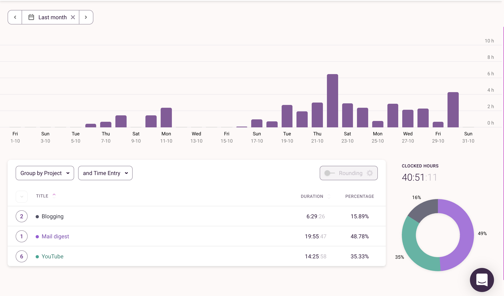
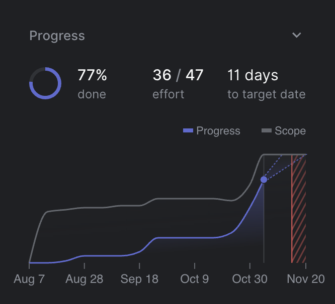

October wasn't the most productive month. At the beginning of the month, I was away in Kyiv, Ukraine for my vacation. After I came back I got sick and was in bed for more than a week. I started doing something productive somewhere in the middle of the month.

If you are curious about last month's retrospective where I explain the idea behind those posts, you can find it [here](https://dpashutskii.com/2021-september-retrospective/).

## ⏰ Time

In October I spend **68 hours** working at my main job and **40.5 hours** working on my side projects. It's actually a good result, considering I only have time during the second part of the month.

Here is a review of where my "side project" time went:

What was a surprise for me is that writing last month's retrospective took me **5 hours**. I am still pretty bad at writing and the speed is slow. But from this month I've decided to put much less effort into it. I also have a template now so it should be much faster.

An extra hour of blogging activity is my Telegram channel post.

As I said last month I need to double the effort on my current side project and I did. The project is now much closer to launch.

YouTube took **14 hours** and it's a pretty good result for the half of the month I've got. I usually try to reserve one hour in the morning for YouTube so it's somewhat accurate.

I am quite happy with this month's results and I'm looking forward to what I can do in November.

## **📺 YouTube**

Not much happened with my channel in October. Just a slow growth and it's normal.

During 14 hours I created and uploaded **two videos** - one on the [Russian channel](https://www.youtube.com/channel/UCqgoEzNIMYpCQNEGxawx_6w) and one on the [English one](https://www.youtube.com/channel/UCtZd4Chy6nqjX1X06ypzEgw).

It was a [collaborative video](https://youtu.be/KxLybkHGmAY) with my wife about 3 years of travelling and digital nomading.  What we learned during this period and some tips for the audience. The video wasn't a success on both channels although it performed a bit better on the Russian one.

Let's dive into stats:

### 🇬🇧 English Channel:

- ⭐️ +63 new subscribers - total on 04.11 - 580 (**+37%** from September) ✅⬆️
- ⭐️ +3.8k views - total on 04.11 - 79.2k (**+19%** from September) ✅⬆️
- ⭐️ +229.6 hours watch time - total 4.7k (**+22%** from September) ✅⬆️
- ⭐️ 6.6% Average Impression click through rate (**-0.2** from September) 🔵↕️
- ⭐️ 34.8% Average percentage viewed (**+7** from September) ✅⬆️

### 🇷🇺 Russian Channel:

- ⭐️ +51 new subscribers - total on 04.11 - 379 (**-55%** from September) 🔴⬇️
- ⭐️ +3.5k views - total on 04.11 - 18.8k (**-36%** from September) 🔴⬇️
- ⭐️ +352.2 hours watch time - total 1.8k (-**24%** from September) 🔴⬇️
- ⭐️ 6.4% Average Impression click through rate (**+1.3** from September) ✅⬆️
- ⭐️ 47.7% Average percentage viewed (**+6.5** from September) ✅⬆️

## **👨‍💻 Side projects**

### 🌮 Taco digest

I am happy with the results I reached this month for the main project I'm working on. My wife also helps me with design so it's her achievement as well.
We came much closer to launch and I am going to do it this month. There are a few critical bugs to solve. I am also still in the middle of a conversation with Google to increase their YouTube API quota. The default quota is ridiculously small and I can't launch with it.
Besides, I want to launch this project with payment from day one. It will have a free tier but paid tier will be accessible as well. For that, I need to add a payment system which will be Paddle for the lack of alternatives in my country.
Short overview from the linear on how the project is going. You can see that curve in October is much steep than before meaning I am making good progress.
Oh and I deployed it on Heroku as well 🥳 Let's see if I can meet the deadline and launch it this month.

## **✍️ Writing**

I want to get into writing but it is not my priority for now. I'm going to take the whole month somewhere next year and spend it on writing.

### ✉️ Telegram channel

I continue to write for my Russian Telegram channel (["AnotherWayOut")](https://t.me/another_way_out) but it's not a very prioritized task. It's a place where I enjoy writing in my native language and my replacement for Instagram. In October I published 5 posts and scheduled another 3 or 4. It took me one hour so it's a great result.

A little summary:

- ⭐️ Published **5 new posts**
- ⭐️ **+8** new subscribers - total **246** on 04.11

### ✉️ Email newsletter

This month I was exploring another opportunity for writing. I want to find a place like my Telegram channel but for writing in English. After a little exploration, I realized that Telegram channels are pretty much dead in English. My conclusion was that the best place to write for an English audience is an email newsletter.

For now, I only created and designed my newsletter page but hopefully, I'll start writing there soon. If you are curious here is the page: [https://newsletter.slowandsteadyblog.com/](https://newsletter.slowandsteadyblog.com/)

I picked [getrevue.co](http://getrevue.co/) as a platform because it seems simple and it allows you to integrate your newsletter on your Twitter profile, which is cool.

## **💰 Money and FIRE**

I and my wife are rushing from one idea to another where we should live in the next year and further. We're waiting for Canada to open its immigration programs for 6 months already and nothing seems to be changing in that regard. We were considering many countries where we want to settle and wait for Canada. We even almost decide to go to Portugal on their D7 visa next year.

But eventually, our goal of doing FIRE was the main point on staying in Georgia. We're quite happy here, at least for the next couple of years. While Canada is still closed, we decided to stay and focus on savings. Georgia is great for saving because it's a cheap country and we have a company with a 1% income tax here. You probably won't find smaller income tax anywhere in the world. They also allow you to get any foreign passive income tax-free such as dividends, royalty, capital gains etc.

In October, I was shifting my assets to Interactive brokers from my Russian bank and everything went smoothly. Even international transfer from Georgian bank is quite cheap. I was afraid that Wire transfer could take big fees on the road but it didn't.

I still have some investments in my Russian account but they are down so I'll sell them later.

**FIRE stats:**

- ⭐️ I stand on **17.69%** towards my FIRE goal number.
- ⭐️ My Net Worth growth **+13.7%** in September.
- ⭐️ My current Net worth allocations: **37.37% invested + 65.65% in cash.**

This was a great month of growth and increasing investment part with new broker.

**Assets allocation:**

- ⭐️ 35.3% S&P500 index fund
- ⭐️ 23.62% VTI Total US Stock index fund
- ⭐️ 16.98% NASDAQ index fund
- ⭐️ 5.47% VXUS Total International Stock index fund (no US)
- ⭐️ 9.66% Other stock and bonds
- ⭐️ 8.90% Cryptocurrency

I finally have my hands on these awesome Vanguard index funds and I moved everything there.

The reason why there are still so many in old funds is that my wife didn't move her assets yet.

My current strategy will be dead simple 80% VTI + 20% VXUS. Yes, no bonds, huge part of stocks are US market. And crypto only what I already have, want to down it to 3-5% and then think about it.

Right now I also considering real estate but I only learning so nothing happening there yet. Even not sure if I am gonna go for a physical property or something like REIT.

## **🎮 Reading and Entertainment**

In October I finished reading [“Never Split the Difference: Negotiating As If Your Life Depended On It” by Chris Voss](https://www.goodreads.com/book/show/26156469-never-split-the-difference). The book is quite good but if you don't revise knowledge from it, it will fade away. I am trying to do this via Kindle highlights and email newsletter but not sure if it helps. Anyway, I've got some good tips from the book and I hope I'll apply them in life.

I am still playing [Persona 5 Royal](https://store.playstation.com/en-us/product/UP0177-CUSA17416_00-PERSONA5R0000000/) making it about ~40 hours in total which means I spend about 20 hours in October.

Since we're both gamers with my wife we have to share PS4 and in the latter half of the month, she was playing. I tried to find good games on M1 Mac but the support isn't that good.

I ended up starting FFXIV which is technically a MMORPG. I am playing it just because Final Fantasy is my favourite game series and it has a great story (yeah MMORPG with a story, I know!). So far I like it and the game is quite easy-going so it's great relaxation after a busy day.

That's all about October! I'll be back with November Retrospective and follow up with the 2021 review! 🍾🥂
