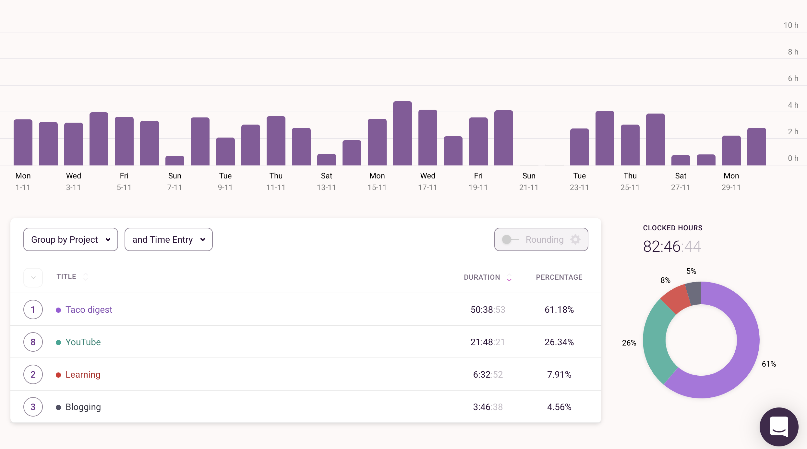
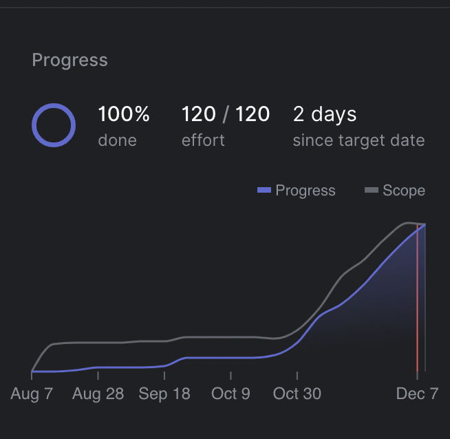
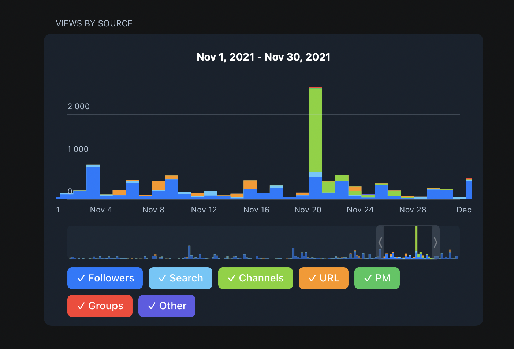

November was a super productive month. I still can't believe how many things you can get done in a month without even sacrificing your job. To be fair I work part-time but still.

## **⏰ Time**

I spent 94 hours working on my job and 82 hours working on my side projects. It's making it a total of 176 productive hours in November. I am an ardent opponent of overworking so it's my limit. I would have never worked more than 180 hours per month and even this amount sounds a bit too much. But I am still happy I managed to set my routine the way I can achieve full potential. I can go tweak from here.

Here is my time tracking report of 82 hours of side projects:

Most of the time I spent on my main side project Taco digest. To be fair the project is already launched (you can check it out on [https://tacodigest.com](https://tacodigest.com/)). But it happened only in December so I won't spend too much time talking about it.

21 hours on YouTube is exactly the amount I would love to spend on it and my posting schedule was perfect.

The learning section includes two things: the "Master of YouTube" course by Matt D'Avella and cards for my driving exam. I am going to get a driving license here in Georgia at the beginning of 2022. I am also happy that in November writing retrospective took me only 1:50 compared to 5 hours in October. It's not something I want to spend too many hours on. About two hours I spent on my Telegram channel. I am trying to be more regular with it. The downside that you can see on the graph that I had almost zero weekends and it's something I want to fix. I'll be working on maintaining the same routine but with two full weekend days.

## **📺 YouTube**

This month my posting schedule was perfect. I posted 4 videos, one per week and it's exactly my plan to maintain. I posted two videos on the Russian channel and two on the English one. It was videos about finding an apartment in Tbilisi and the cost of living in Tbilisi. One thing I started to regret a little was that I have two channels. It would be much easier and smarter to grow one channel and then add a second as the first one succeeded. I'm still thinking about this but now I don't want to drop neither of them. I decided to grow both channels to 1k subs and 4k watch hours to enable monetization and then decide. At least I'll see the picture with my RPM and can plan for the future. I don't do YouTube to make money but I still shouldn't forget about that part.

Let's dive into stats related to YouTube in November:

### 🇬🇧 English Channel (totals on 09.12):

- ⭐️ +59 new subscribers - total 653 (**-6%** from October) 🔵↕️
- ⭐️ +3.7k views - total 83.5k (**-3%** from September) 🔵↕️
- ⭐️ +223.2 hours watch time - total 5k (**-3%** from September) 🔵↕️
- ⭐️ 5.8% Average Impression click through rate (-**0.8** from September) 🔴⬇️
- ⭐️ 34.8% Average percentage viewed (+0 from September) 🔵↕️

### 🇷🇺 Russian Channel (totals on 09.12):

- ⭐️ +185 new subscribers - total 592 (+2**63%** from October) ✅⬆️⬆️
- ⭐️ +8.2k views - total 28.8k (+138**%** from September) ✅⬆️⬆️
- ⭐️ +769.3 hours watch time - total 2.7k (+118**%** from September) ✅⬆️⬆️
- ⭐️ 7.1% Average Impression click through rate (+**0.7** from September) ✅⬆️
- ⭐️ 49.8% Average percentage viewed (+1.9 from September) ✅⬆️

As you can see, the Russian channel is growing soo much faster in and I still don't have a real explanation for that. It's probably a cumulative effect of those:

- less competition
- videos about Georgia are much more interesting for a Russian audience
- I am a native speaker which means I can add some inside jokes and little details

I can't explain the difference in "average click-through rate" though. I use the same thumbnails and titles for both channels. Less competition could be the reason. For example, there were around 4-5 good videos in English about the Cost of living in Georgia and none in Russian.

It's funny because making videos in Russian is also SO MUCH easier for me 🙂

From other good YouTube news, I meet a person who's watching my videos outside. The guy approached me in the area where I live and asked if I'm the guy from the videos about Georgia. 😅 It was shocking because it's never happened to me before. Anyway, we talked a little about Tbilisi for expats and even meet again in a few days and chat more. So everything was great!

Also, my Russian channel got a pretty good boost. One of the big Georgian bloggers shared my telegram post with video link. It got me 1.5k Telegram views of the post and a huge boost in video views.

The same blogger is also starting his Telegram channel in English. He asked me if I can promote this channel on my English-speaking YouTube and he will promote me back. So I'll do this in my next video.

## **👨‍💻 Side projects**

### 🌮 Taco digest

We went with full power on [Taco digest](https://tacodigest.com/) because we wanted to launch it at the beginning of December and we did. The launch was not so good as I expected but still okay.

In November, we finished all the main features we wanted to build and launched a landing page. Google is finally approved my YouTube API quota increase. Even Twitter launched their API v2 which I managed to get access to. For some reason, they always declined me access to their API v1. So I even started working on Twitter integration but it didn't get into the release version. It'll be ready soon.

We already closed our Linear project but you can see how we tripled the effort on it during the last months.

## **✍️ Writing**

I don't put much effort in my writing for now. The only things I write are these retrospectives, a few tweets and posts to my Telegram channel. I still didn't start with my travel/nomad content. I'll make some time for it in 2022.

### Telegram channel

I published 10 posts on my telegram channel, finally making it more/less consistent. I usually spend around one hour once in two weeks and write all the posts for the next two weeks and schedule them.

⭐️ As I said in the YouTube section, one of the bloggers in Georgia reposted my video on their channel and it gained me new Telegram subscribers. In November, I got from 248 to 271 adding 12 new subscribers.

You can see the huge boost in views the day he shared my post:

## **💰 Money and FIRE**

Everything is stable with money and savings. We earned some income and contributed to investments. We have a new plan for the next year which affect our finances dramatically but I'll write about it later.

The FIRE number goal looks the same in the stats below but it's only because I adjusted the goal. I calculate it based on our annual spending from the last years. This month I added 3 more years to the table making the total goal bigger.

Also, I am very happy to see that invested allocations are growing, and cash part is decreasing.

**FIRE stats:**

- ⭐️ I stand on **17.89%** towards my FIRE goal number.
- ⭐️ My Net Worth grew **+12%** in November.
- ⭐️ My current Net worth allocations: **42.97% invested + 58.12% in cash.**

**Assets allocation:**

- ⭐️ **29.36%** S&P500 index fund
- ⭐️ **35.86%** VTI Total US Stock index fund
- ⭐️ **13.53%** NASDAQ index fund
- ⭐️ **7.30%** VXUS Total International Stock index fund (no US)
- ⭐️ **7.15%** Other stock and bonds
- ⭐️ **6.80%** Cryptocurrency

We're increasing Vanguard funds and reducing old Russian ETFs. The goal is to completely remove Russian assets but it'll take some time. Especially for the ones in the red zone like gold funds and bonds.

I'm quite happy with my 80% VTI + 20% VXUS strategy for the future and I'll stick with it. It excludes Crypto which I still don't know how much I want but around 5% is good.

## **🎮 Reading and Entertainment**

I started reading [Dune by Frank Herbert.](https://www.goodreads.com/book/show/43419431-dune) It's been on my watchlist for a while and movie launch was a good nudge to finally read it. I started reading it in English but after ~10% switched to the Russian version because it was quite hard. So many little details and descriptions and names. I finished about 60% so went to see a movie and it was awesome. The cinematography is through the roof.

I am still playing [Persona 5 Royal](https://store.playstation.com/en-us/product/UP0177-CUSA17416_00-PERSONA5R0000000/) making it already 86 hours in total which means I spent about 40 hours in November.

But I also bought a Nintendo Switch! 🥳 I wanted to buy it for a long time and finally made the decision and so far I am happy with the console. It is convenient and has so many great games.

The only downside is the cost of the games. PS4 and PC games became so cheap during the last few years especially if you buy on sales, but Switch prices are huge! But I am happy with the purchase anyway. My first game will be "Ori and the blind forest".

I'm trying to finish all my games I have on PS4. There is a big chance I'll drop PS4 back to Russia next year and continue to travel with Switch only.

That’s all for November! I’ll be back with my 2021 review! 🍾🥂 This year was fascinating.
