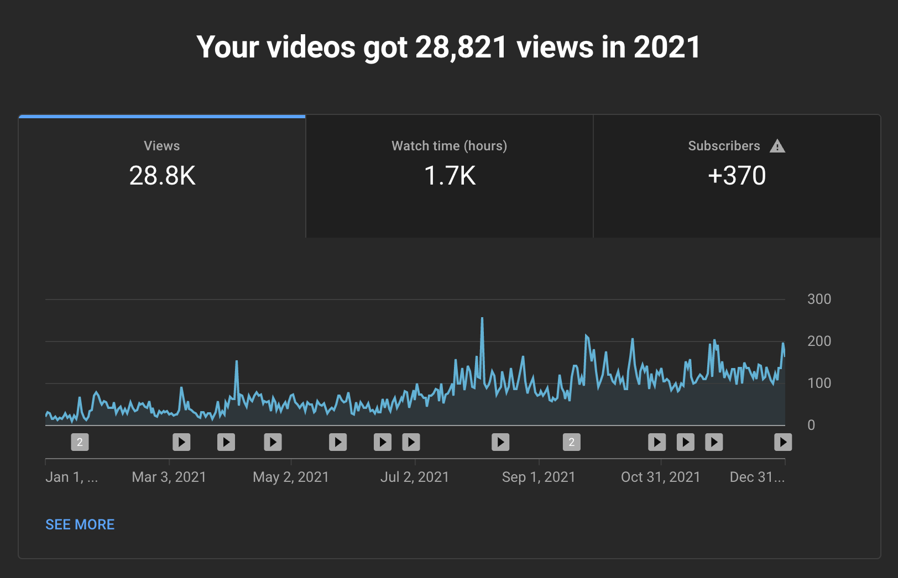

## 🪞 Reflections

This year was a rollercoaster for me. I started with many plans and ambitions but burned out at the beginning of the year. I only started recovery somewhere in September. The end of the year was super productive and I made a lot of progress on my projects.

I was trying to figure out the reasons behind my decline at the beginning of 2021. It was probably the aftershock of the difficult previous year. In 2020, I had depression and mental issues because of what was happening in the world and from travel fatigue. We also couldn’t leave Bali which we get tired of after 1.5 years in there.

So most of the first half of 2021 I was recovering from that stuff. In addition, I quit my job in 2020 and I was a bit lost in indie hacking after a couple of unsuccessful launches.

In the middle of 2021 a few good things happened which helped me to recover faster and get back on track:
- I moved to Georgia and rent a good long-term apartment. It allowed me to recover and relax from travel
- I started working part-time again. It improved the mood from unsuccessful indie hacking experience
- I started waking up early and to exercise more. I reconsidered my information consumption and productivity in general
- I started focusing more and spreading myself less

All that lead to a healthy lifestyle at the end of the year. I finally came back to making regular YouTube videos and launched my first paid product.

The best representation of my year is in GitHub commits:

## ✅ 2021 Goals

This year I started with annual resolutions on Twitter. Let’s see how I progressed on them:

<blockquote className="twitter-tweet">
My goals for 2021 🉠I want to be focused this year.  📺 Content creation: YouTube and blogging, want to finally dig into that 🇨🇦 Immigration to Canada: start the process and move to Vancouver 🚢 Ship at least 5 more side projects and start getting income. Or find the freelance
&mdash; Dmitrii Pashutskii 🇬🇪 (@guar47) <a href="https://twitter.com/guar47/status/1349251840899129345?ref_src=twsrc%5Etfw">January 13, 2021</a></blockquote>

### Content creation ✅

I can say this one is a success. I started making YouTube videos again for two channels on a regular basis. I'm happy about my comeback on YouTube and looking forward make more content this year.

I can't say the same about writing though. I didn't write much in general. But at the end of the year, I started writing monthly retrospectives. It's nice to see progress within a period. Help you to understand progress better.

Definitely planning to write more in 2022.

### Immigration to Canada 🚫

Not a successful one but we did everything we could from our side. We prepared all the documents, valuated diplomas, passed the IELTS exam and signed for the program. We technically passed all the requirements for immigration but COVID made it impossible to move. Canada stopped all the invitation process on the 1st of January 2021 and it’s still on hold.

A lot of things changed since then. We already have doubts about whether we even need to move to Canada. There are other better opportunities like Portugal. We still didn’t cancel this but it's not as clear as a year ago.

### Shipping side projects ✅🚫

I had some issues with building side projects at the beginning of the year. In total, I shipped only two products ([NextPlace](https://nextplaceto.com/) and [Taco Digest](https://tacodigest.com/)) instead of five.

I still consider this goal a success, especially the last launch. Taco Digest was my first paid product and I even got one paying customer. The product is interesting to work on and I’m very excited to grow it in 2022.

I failed to ship five projects but I’m happy with the results anyway. I like that I came back to productive shipping at the end of the year and got my wife on board as well.

## ⏰ Time

I track my time making it easier to analyze the progress later.

This year I tracked 566 hours and 18 minutes. It’s around 47 hours per month or 12 hours per week. Not a big amount but let’s see how I spend it:

I’m happy with the time I spent on YouTube videos.

I spent too many hours making Taco Digest without launching it. I should have made an early launch and then continue development.

Nextplace project was also a mistake because I didn’t even launch it. It took so much time because I was using Django and Python which I didn’t have experience with. Afterwards, I decided to re-write it to Next.js which also wasn’t a necessary step. The product is still up there but I’m not sure what to do with it.

Almost all hours of Learning I spend on IELTS exam preparations. It was necessary because we need it for our Canadian immigration. If we decide not to go to Canada it wasn’t the best way to spend time though.

All the other projects were insignificant so I won’t review them.

## 📺 YouTube

I’m quite happy with my progress on YouTube. I love making videos and it pays off with the increasing audience and improved quality.

In 2021, in addition to my [English-speaking channel](https://www.youtube.com/c/DmitriiPashutskii), I created [one in Russian](https://www.youtube.com/channel/UCqgoEzNIMYpCQNEGxawx_6w). I am making videos on the same topics but creating two versions of them in each language.
I made 13 videos for my Russian channel and 15 for my English one. Let’s dive into numbers.

### 🇷🇺 Russian channel

- +687 subscribers (687 total)
- +34600 views
- +3200 hours watched

Here is a screenshot from the analytics page:

The consistency pays off and videos are becoming more popular with time. I’m close to the monetization milestone on this channel. The best approach here is to publish videos more often. The amount and the frequency of the content are still crucial parts of success on YouTube.

### 🇬🇧 English channel

- +370 subscribers (712 total)
- +28800 views
- +1700 watched hours

Analytics page screenshot:

The English Channel has more slow but consistent growth. I already had 62 videos on this channel so they compound with time. Compared to the Russian channel where views are jumping in peaks.
This growth could be bigger considering the number of videos I have on the channel. But if we bear in mind that I pivot the channel it's fair that growth is slow. It was a travel vlog before and now it's informational digital nomad content.

Fun fact that on the English channel only 5 of my top 10 viewed videos were posted in 2021:

In general, making videos in Russian is easier and a bit more rewarding because it's rising faster. But I still love making videos in English. I use English Internet and participate only in English-speaking communities.

Once I hit monetization on both channels I’ll think if I should focus on one of the channels or continue to invest in both. I expect that I reach monetization on both channels in February - April.

I don't have plans on changing much in my tactics for YouTube. I want to make each video as good as I can and stick to the regular posting. I want to take more part in creators' communities to get feedback and find collaborations. I also want to work on different monetization tactics for the channel like creating a course, Patreon, e-book, affiliate etc.

## 🛠 Side projects

This year I managed to ship only two products despite aiming for five.

### 🗺 Nextplace

The first product in 2021 was [NextPlace](https://nextplaceto.com/) - website with information about digital nomad visas. This was a learning project which was a bad idea if I wanted to make a business of it.

I wrote it in a completely new tech stack for me (Python and Django). Then I realized that I won’t be able to support it on these technologies and rewrote it again in Next.js.

Learning Django and making a project with it, took a lot of time. When I completed it, I lost track of why I was building this product in the first place. There are similar websites that show exactly the same information. Right now NextPlace is sitting there and I have no idea what to do with it 🙂 I didn’t share or launch it anywhere. I'll think later about its future.

### 🌮 Taco Digest

The second project was way more interesting - [Taco Digest](https://tacodigest.com/). It's a personal newsletter digest. You can customize your own newsletter from different sources across the web.

I worked on it from May and only launched it in December. 8 months is way too long to work on MVP. I should have launched it after 2 months and spent the next 6-month looking for customers. It was a good lesson so from now on I'll be launching early.

I love the product and even my wife joined along the way to help with the design and development. It’s my first paid product and we even managed to land the first customer. It isn’t much but it was an important milestone. So far we only launched on PH and Twitter. We have 63 sign-ups and some good feedback.

In 2022, I’m planning to focus on marketing and finding new customers for Taco. But also building new features that are requested more often.

The marketing part will involve a lot of learning and experimenting. I have very small knowledge in that area. Early on, I want to focus on SEO since it takes a long time to take off and it’s one thing I know at least a little about.

And I need to start with the beginning of the customer funnel - leads (awareness). On the day of launch, we have many visitors but it felt down afterwards.

Here is SimpleAnalitycs of the landing page:

## ✍️ Writing and Social media

### 👨‍💻 Blog

As I mentioned in the first part I wasn’t writing much this year except my monthly retrospectives. Since September I published three of them in total on [this blog](https://dpashutskii.com/). They help me reflect on the past month so I’ll continue writing them in 2022. I decided to skip December but write this 2021 review instead.

### ✈️ Telegram channel

Another place where I write is my [telegram channel in Russian](https://t.me/another_way_out). I use it as secondary social media for my Russian YouTube channel.
It gives me extra views when the new video comes out. You can say I have my “true fans” there who is always great to interact with 🙂 I would love to have a similar place for my English-speaking channel but still haven't found it.

I wasn’t posting much at the beginning of the year but started being more consistent by the end of the year. Instagram banned my account and I've decided to stop using this terrible social media 😂

My followers dropped from 239 since the beginning of the year to the lowest amount of 222 in the middle of the year. But they grew to 285 at the end when I started posting consistently. Also, I added a telegram link to my YouTube page so I guess many people came from it.

### 🧳 Slowandsteady

This year I also launched my [travel/digital nomad blog](https://slowandsteadyblog.com/) but I didn't write anything there. I had a couple of old travel articles so I updated and posted them on this blog.

I want to start writing for the blog this year. I’ll start with converting my YouTube videos to blog posts to improve SEO and discoverability for the channel.

## 💰 Money

Even with me only working 5 months this year the money situation is only improving. My wife was still working the whole year and we made good investments, so our net worth is growing.

### 🤑 Spending

We track our expenses for the last 5 years and it helps a lot with planning and budgeting.

Most of this year we spend in Tbilisi, Georgia renting a long-term apartment. It's much cheaper than our usual Airbnb places. At the same time, we spent too much money on electronics and gifts this year.
Not taking into account $8600 on "shopping" I can say it was a good year. One of the cheapest for a long time.

Here is a Google spreadsheet of our expenses:

### 🔥 FIRE and Investments

We were investing the whole year and it started to pay off growing our net worth even further.

Money stats:
- We grew our Net Worth **77%** in 2021 this year which is incredible
- We are currently at **19.36%** toward our FIRE goal
- Current Net worth allocations: **48.99% invested + 52.63% in cash.**

Investment allocations:
- **44.52% VTI Total US Stock index fund** - main investment fund we’re buying
- **24.49% S&P500 ETF** - selling but still have quite a lot
- **10.78% NASDAQ ETF -** also selling
- **9.71% VXUS Total International Stock index fund (no US)** - diversification to VTI fund, buying
- **6.06% Other stocks and ETFs -** small percentage of different stuff which is currentely down. I’ll sell them in a few years.
- **4.52% Cryptocurrency (BTC, ETH, ADA, XLM) -** I didn’t buy anything in crypto for a while. I’ll start when it falls down to less than 4%.

Our main strategy is **80% VTI + 20% VXUS** and it stays the same for upcoming years.

## 🧳 Travel

The last section is new because I don't post about this in my monthly retrospectives. It is more interesting to post about travel on the scale of the year.

This year we didn’t travel much though because we decided to take a break and settle down in Georgia for 6 months. It was a great time to recover and we are very excited to get back on the road in 2022.

In 2021, we travelled to 4 countries and 7 cities.
Countries: 🇹🇷 Turkey, 🇷🇺 Russia, 🇺🇦 Ukraine and 🇬🇪 Georgia.
Cities: 🇹🇷 Antalya, 🇹🇷 Istanbul, 🇷🇺 Saint Petersburg, 🇺🇦Kyiv, 🇬🇪 Tbilisi, 🇬🇪 Stepantsminda, 🇬🇪 Batumi

Surprisingly, it was the most social year for us and we met so many great people in Tbilisi. We made more friends during the last 6 months than in the previous 3 years of travel combined. It’s amazing and I’m going to miss everyone when we leave.

---

That’s it for 2021!

I’m planning so many interesting things for 2022 and I’m very excited to start ✨ This year I decided to post a simple annual resolution to channel my focus. Here is the resolution tweet:

<blockquote className="twitter-tweet">
I was a big fan of new year&#39;s resolutions but I&#39;m at an unpredictable and experimental stage so I only set one goal for the 2022:   💰Make some money on my projects 💰  My soft goal is $1k per month and perfect goal is $2k. Any income counts except my job/freelance or investments
&mdash; Dmitrii Pashutskii 🇬🇪 (@guar47) <a href="https://twitter.com/guar47/status/1478030865632477186?ref_src=twsrc%5Etfw">January 3, 2022</a></blockquote>
