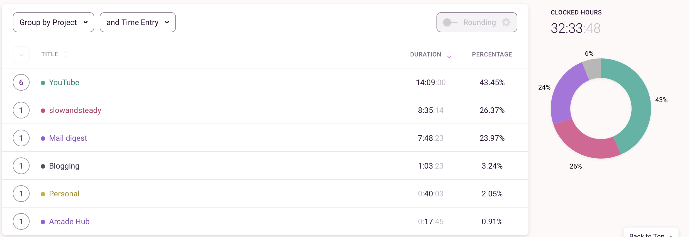
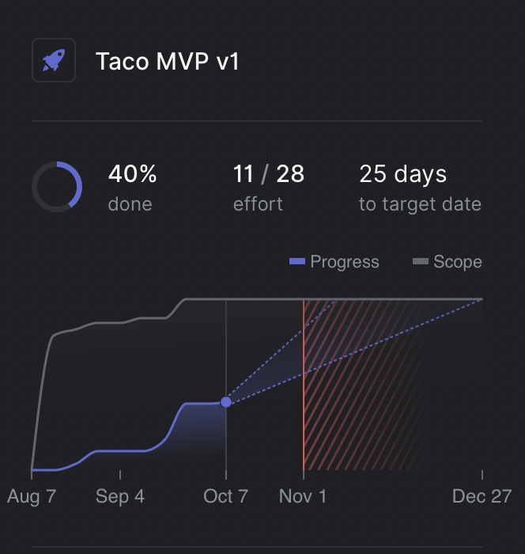

I've decided to post monthly retrospectives with reflections on my life goals and personal projects. I am still not sure what format to follow so I'll experiment on the way.

The main goal is to reflect and better understand how productive was the time in the last month. 

Since this is the first time I'll also describe a bit more about my projects and what I'm working on.

## ⏰ Time

Let's start with time management. I track all my work and side projects time so I can easily answer the question "Where all the time go?!". My team uses Harvest at work and I use it for invoicing (as a part-time contractor) as well. For personal projects, I use Toggl Track with all my projects.

In September, I spent **89 hours** working at my job and I have **32.5 clocked hours** among different projects. 

Here is a detailed review of Toggl Track:

YouTube took most of my time in September. 

**["Slowandsteady"](https://slowandsteadyblog.com)** is the name of my new travel blog that I've been planning to start since the beginning of time. Finally, I launched it.

**"Mail digest"** is the main side project I'm working on right now and I should have spend more time on it, to be honest. I'll try to focus on it in October.

## 📺 YouTube

One of my 2021 resolutions was to restore my YouTube channel and I did. I've had great progress in that area since summer. I am enjoying making YouTube videos. Even if I am far from success by any means I'll continue pursuing this side hustle. Because I enjoy it so much, money is not an essential thing here. 

YouTube is quite a rewarding platform. Without many subscribers, I have a decent amount of views/engagement/new people met. Just because of my videos and it's awesome.

I have two channels: the [English channel](https://www.youtube.com/channel/UCtZd4Chy6nqjX1X06ypzEgw) and the [Russian channel](https://www.youtube.com/channel/UCqgoEzNIMYpCQNEGxawx_6w). I prepare the same content and record it in two languages and post it on different channels. I am still looking for my niche and trying to experiment with different topics. The main areas are travel, digital nomad lifestyle and remote work. Occasionally, I post something related to software development. 

The whole motto of the channel is to learn programming and travel the world or be a nomad. Like me, yes. 😎 

Besides, I enjoy making "destination reviews" which are kinda city guides for nomads. I always look for such videos when I am picking a new place to visit so I hope other people find it useful too.

It seems people are loving watching about these topics nowadays and I have some stuff to share with them.

Let's get back to September and my progress on the YouTube channel.

During these *14 hours* you've seen in the Time report, I made and posted **3 videos**. One for Russian Channel and two for the English channel. My minimum goal is one video per week so I am a bit behind.

I had two great milestones this month. I reached **500 subscribers** on the English channel and **300 subscribers** on the Russian one.

Below are the main stats on the channel for September.

🇬🇧English Channel:
- ⭐️ +46 new subscribers - total 515 (**+92%** from August)
- ⭐️ +3210 views - total 75k (-6% from August)
- ⭐️ +188.3 hours watch time - total 4500 (**+4%** from August)
- ⭐️ 6.8% Impression click through rate (**+0.5** from August)
- ⭐️ 34.1% Average view duration (**+4** from August)

🇷🇺Russian Channel:
- ⭐️ +113 new subscribers - total 515 (**+49%** from August)
- ⭐️ +5379 views - total 15.5k (**+108%** from August)
- ⭐️ +460.8 hours watch time - total 1500 (**+68%** from August)
- ⭐️ 5.1% Impression click through rate (-0.8 from August)
- ⭐️ 41.2% Average view duration (-6.9 from August)

## 👨‍💻 Side projects

### 🌮 Taco digest

The main project I working on is called "Taco Digest". It's gonna be a customizable personal mail digest. I am working on this project for way too long already. I hope I'll finish MVP as fast as possible.

This month I did some progress on improving the look and functionality of the mail digest editor. Also, I've added YouTube as a new source for digests. Now you can track new videos from your favourite creators.

I have to spend more time in October to focus on important tasks. At least deploy the project to production and start using it myself. A have a few critical things yet to finish but I'll get there soon.

A small overview of project progress provided by Linear app:

I set the deadline date for MVP to the 1st of November and I hope I manage to at least deploy something usable before that date.

### 🧳 SlowAndSteadyBlog

Another project that take time this month was my [travel blog](https://slowandsteadyblog.com). I am not planning to write in it yet. I wanted to publish it, so Google could start crawling my pages. I only have two articles but the blog itself looks good enough so I don't worry about it much. I'll let it soak for Google and come back to it later.

I build it with NextJS, using tailwind-blog-template as a foundation. It's my first blog on NextJS after using Gatsby for a while and I am quite happy with this framework. 

The only thing I still need to fix is image optimization. Images take too long to load and there are no blurry placeholders as it was by default with Gatsby.

## ✍️ Writing and social media

I want to start writing more articles but so far I didn't have much progress on it in September. 

This post is one step to writing more to this blog and I'll come back to my travel blog soon.

### ✉️ Telegram channel

Another place where I write is my [Russian telegram channel](https://t.me/another_way_out). In case you don't know it is similar to email newsletters but inside the messenger. People can follow your channel to read your posts and they can comment. 

There are no rules on what to post on your channel so every channel owner uses it differently. Some people share big posts there and others treat it as social media with short and frequent messages.

I am somewhere in the middle. I post semi-long articles but also post some photos/videos from time to time. The main topics for the channel are the same as for my YouTube: travel, nomadic lifestyle and remote work.

A few stats from September for my channel AnotherWayOut:

- ⭐️ Published **6 new posts**
- ⭐️ **+4** new subscribers - total 238
- ⭐️ 117 average views per post

Telegram is not a rewarding platform since it doesn't have any discovery features or SEO doesn't work here. That's why I don't put much effort into it. It's more like my own very small social media where I share discoveries and don't worry much about exposure.

I also post links to my Russian videos there which gains me a few views. This channel will be much more useful once I get a bigger subscriber base on my YouTube channel.

### 🤳 Social

I don't focus on any social media right now. I was active on Instagram for the last year but it gets me no advantages at all. A week ago, as a blessing in disguise, Instagram blocked my account. They terminated my account for the usage of a third-party app for analytics. They blacklisted my devices so if I try to create a new account it gets immediately suspended. 

I figured it's a good sign to stop using this social media and focus on more long-term platforms. Creating evergreen content feels more productive and enjoyable thing to do.

I was thinking about ditching Instagram for a while so I am okay about what happened.

I have [Twitter](https://twitter.com/guar47) but I don't use it much except scrolling it for a few minutes during the day. 

I post there some news or my discoveries but nothing serious. Twitter is an amazing tool for building in public so I'll be using it more in the future.

## 💰 Money and FIRE

I discovered the concept of FIRE (Financial Independence/Retire Early) In 2020 and it was my goal ever since.

I don't consider FIRE as my endpoint as some people on Reddit. Sitting and doing nothing seems like a terrible idea for me.

What I want is to reach Financial Independence so I don't need to worry about the money anymore. I would love to focus on my passions and side projects without thinking about money.

The first step of the FIRE journey is to set your goal number and unfortunately, I can't do this yet. The reason is that I am travelling and moving places so I don't know where I end up living in the future.

I did some calculations based on my last years and COL of some places where I could imagine settling down. After reaching this number I can be sure I can either travel or move to one of the destinations.

A few statistics and numbers:
- ⭐️ I stand on **10.61%** towards my FIRE goal number.
- ⭐️ My Net Worth growth **+4.7%** in September.
- ⭐️ My current Net worth allocations: **30.61% invested + 73.20% in cash.**

I spend way too much money in September because I bought MacBook, Apple Watch and send my Mom on a vacation. 

Autumn and winter months I usually spend much less. I live in Tbilisi now which is a low cost of living place. Plus, I opened a company here which gave me a pretty nice income tax benefit. So I'll save more in the upcoming months.

I still have quite a huge chunk of cash, most of it is on deposit accounts. It's fine for now because I'm going to move to Canada which could lead to some expenses.

My investment allocations:
- ⭐️ 49.2% S&P500 index fund 
- ⭐️ 23.7% NASDAQ index fund 
- ⭐️ 15% Other stock and bonds 
- ⭐️ 11.2% Cryptocurrency

Soon I'll move my investments from the Russian platform to US-based Interactive Brokers. It'll allow me to pick from much wide variety of Index Funds and pay much fewer fees. In Russia, there are about ~30 index funds in total and fees management fees are around 0.8%-0.9%.

Another bad thing about my investments is the amount of cryptocurrency. I am aiming to reduce it to *3-5%*. 

I bought them quite a while ago and since it was growing crazy it takes a huge percentage of the portfolio now.

Otherwise, I am quite happy with all my investments and I'll continue to contribute to them monthly.

## 🎮 Reading and Entertainment

This is an optional part but it could be fun to add it.

In my spare time, I enjoy reading, watching TV shows and playing video games. I was into movies my whole life but I've reached the point where I watched all the great movies. Something good rarely comes up nowadays so I don't watch movies much.

The main console I am playing is Playstation 4. I would love to upgrade it to the 5th version but it's so huge I can't travel with it.

I am considering buying Nintendo Switch though. I was a gamer my whole life and focus on good single-player games with a good story. I rarely play multiplayer or online games.

### 📚 Reading

In September, I finished ["The Simple Path to Wealth: Your road map to financial independence and a rich, free life" by J.L. Collins](https://www.goodreads.com/book/show/30646587-the-simple-path-to-wealth).

It's an amazing book with an introduction to financial independence and investments. I would recommend reading it to anyone who wants to start this path. There are few criticisms of this book that is very focused on the US market and life in the US in general but I don't see it as a problem. 

The author describes a lot of concepts that could work anywhere. Also, the US is one of the dominant markets for investments, so everyone is investing there anyway.

Right now I am reading ["Never Split the Difference: Negotiating As If Your Life Depended On It" by Chris Voss](https://www.goodreads.com/book/show/26156469-never-split-the-difference).

I don' have an opinion on the book yet. It feels like one of these books that you enjoy reading but don't get to apply the knowledge from it in real life.

I've started using an app called 'Reading Notes". It scans your Kindle highlights and sends you a random one every day to email. It should improve memorizing stuff from the books. With it, I might be able to pick up more from that book.

### 🎮 Video games

I started September by playing [Days Gone](https://www.playstation.com/en-us/games/days-gone/) but got a little bit bored of repetitive quests of the game. Although, the vibe in the game is awesome. I enjoy this The Walking Dead type of atmosphere.

Halfway through the month, I bought [Persona 5 Royal](https://store.playstation.com/en-us/product/UP0177-CUSA17416_00-PERSONA5R0000000/) on discount and completely drowned in the game. I am a huge fan of Japanese video games, especially JRPGs and this game is a gem of that genre. It is so addictive and enjoyable I am happy I picked it up. I already played around **15 hours** in it.

---

That's all for the September of 2021 retrospective.

I enjoyed writing this, feels like journaling in public. I hope I'll make a habit of this. It's gonna be interesting to compare all the results during the longer periods.

If you have any suggestions or comments, feel free to reach me on Twitter. If you also write similar retrospectives, I would love to read yours and inspire.

See you in November 👋
