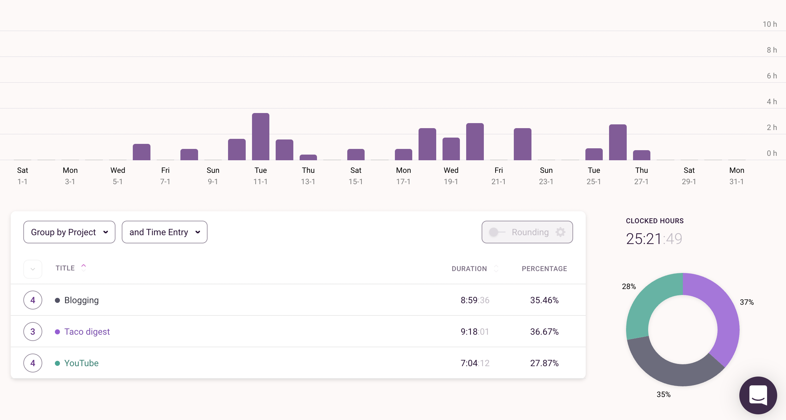
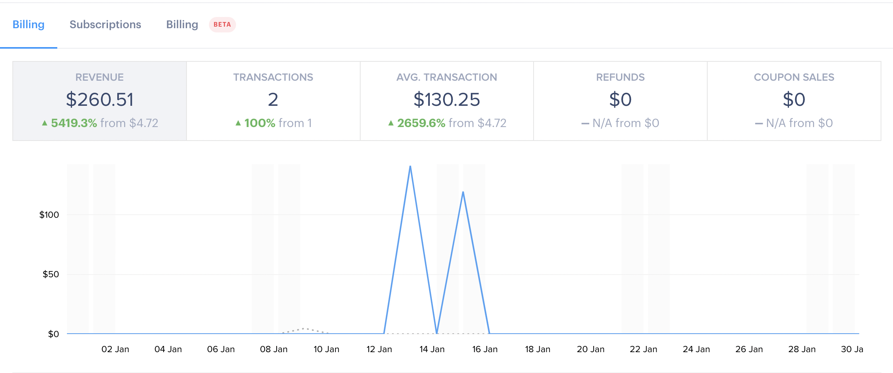

January wasn’t productive because I had a lot of preparation before moving to Batumi. We also had a lot of goodbye parties with all the amazing people we met in Tbilisi 🇬🇪 I also took a vacation in the first week of January and did absolutely nothing 🌶

## **⏰ Time**

You can immediately see the effect of the unproductive month on the time tracking graphic. I had a few productive days and that’s it.

## **📺 YouTube**

I love that even when I publish zero videos in a specific month, YouTube continues to grow. I think it’s one of my favourite things about evergreen content (YouTube, blog posts) compared to social media where if you don’t post for a month it would be a disaster.

As usual, the Russian YouTube channel is thriving and when I’m writing this post I already achieved 4000 hours for monetization. All I need is 1000 subscribers now which probably happen in February.

### **🇬🇧 [English Channel](https://youtube.com/DmitriiPashutskii) (totals on 10.02.2022):**

- ⭐️ +67 new subscribers (-14% to December) - total 812 🔴⬇️
- ⭐️ +4k views (+1% to December) - total 91.7k 🔵🆗
- ⭐️ +250.4 hours watch time (+4% growth to December) - total 5.5k 🔵🆗
- ⭐️ 6.1% average Impression click through rate (-0.2 to December) 🔵🆗
- ⭐️ 36.3% average percentage viewed (+0.6 to December) 🔵🆗

### **🇷🇺 [Russian Channel](https://youtube.com/ДмитрийПашутский) (totals on 10.02.2022):**

- ⭐️ +179 new subscribers (+39% to December) - total 919 ✅⬆️
- ⭐️ +7.6k view (-3% to December) - total 44.4k 🔵🆗
- ⭐️ +698.5 hours watch time (+19% to December) - 4.1k ✅⬆️
- ⭐️ 7.3% average Impression click through rate (+0.9 to December) ✅⬆️
- ⭐️ 46.8% average percentage viewed (+11.5 to December) ✅⬆️⬆️

## **👨‍💻 Side projects**

### **🌮 [Taco digest](https://tacodigest.com)**

In January we didn’t do much for Taco. Mostly focusing on fixing all the bugs after launch and trying to spread the word about the project.

In January, we also sold two LifeTimeDeals for Taco and we removed this type of payment from the project. Now we’ll only focus on subscriptions.

## **✍️ Writing**

### **✈️ [Telegram channel](https://t.me/another_way_out)**

I published 3 posts on my channel. I like that Telegram started growing on its own. There was a time when the growth was stagnant. People are mostly coming from a YouTube channel and when my post got shared on the bigger channels.

In January, I got from 272 followers to 301, adding +29 new followers.

## 💸 **Income**

I decided to add a new “Income” section to my monthly report. I probably won’t have much of an income for a while but it’s good to start reminding myself of [my annual goal](https://twitter.com/guar47/status/1478030865632477186).

The only income I have for now is from Taco Digest and since we sold 2 LifeTimeDeals it added to January.

When we sold them I discovered how horrible PayPal fees are so I disabled the ability to pay through PayPal for Taco Digest.

Here is a screenshot from my Paddle account with numbers:

## **💰 Money and FIRE**

The market is crushing a little hence not much growth this month. I continue to stick to the plan: dollar-cost average investing and reducing my cash allocation. Also, slowly selling my old Russian index funds and only focusing on Vanguard.

I finally reached less than 5% in crypto so I’m thinking of buying more to restock it back to 5%.

### 🔥 **FIRE stats:**
- ⭐️ **20.53%** towards my FIRE goal
- ⭐️ My Net Worth grew **+4.82%** in January.
- ⭐️ My current Net worth allocations: **52.23% invested + 48.95% in cash.**

### 📈 **Assets allocation:**
- ⭐️ 50.38% VTI Total US Stock index fund
- ⭐️ 20.53% S&P500 index fund
- ⭐️ 11.96% VXUS Total International Stock index fund (no US)
- ⭐️ 8.64% NASDAQ index fund
- ⭐️ 5.25% Other stocks and ETFs
- ⭐️ 3.23% Crypto

## **🎮 Reading and Entertainment**

I finished [Dune by Frank Herbert](https://www.goodreads.com/book/show/43419431-dune). It’s a great book overall but I feel like I need a break before starting the second and third book. So I started reading non-fiction again.

In January I started reading [Zero to Sold by Arvid Kahl](https://www.goodreads.com/book/show/54323859-zero-to-sold). I’ve been following him on Twitter for a while and he is a great guy who posts a lot of great content for entrepreneurs.

In January, I was playing [Persona 5 Royal](https://store.playstation.com/en-us/product/UP0177-CUSA17416_00-PERSONA5R0000000/). But when I’m writing this I already completed it. I played 151 hours making it the longest game I’ve ever played in my life 😅 The game is worth it though. I enjoyed the time in this weird universe.

--

That’s it for January. As you can see below, I added a newsletter to my blog. If you want more content about the process of being a YouTuber and entrepreneur, feel free to subscribe. I still haven’t sent the first newsletter but it’ll happen soon.
