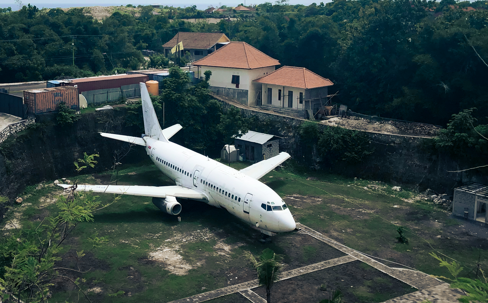

`youtube: https://www.youtube.com/watch?v=aMCLvWapM7g`

I've been living in Bali for 15 months in a row in 2019-2021. I'm always tracking my spending numbers. So I collected average numbers on how much it costs to live in Bali, Indonesia.

You should read this with a grain of salt because all lifestyles are different. You could spend more or less than me. I am trying to live on a budget but maintain comfort. So my cost of living it's something average for nomads/expats.

Bali is a big place and I've been living in "digital nomad" areas: Canggu, Pererenan, Kerobokan, Pererenan, and Ubud. There are more "local" areas where you can expect cheaper prices.

I live with my wife so most of our costs are true for couples. But I'll try to break down the price for single people.

All prices in the article are in US dollars adjusted for the average exchange rate in 2020: *100,000 IDR for 7$.*

## 🏡 Accommodation

This is the most expensive category but it depends on your appetite for comfort. You can find a very simple guest houses for 300$ but also very expensive private villas for 2000$.

I've lived in different types of places. I prefer a one bedroom with private kitchen, desk for work and sometimes pool. It usually includes cleaning 2-3 times per week and doesn't include electricity.

Most of the time we pay around 500-700$ per month. During the COVID-19 we pay the same but get more space for the same amount. Electricity is expensive in Bali. You can add 60-80$ to the total price. That's the price I recommend to count on, especially if you're going to stay for more than one month.

This category doesn't split if you're alone. Unlikely you will find the place for one than will be cheaper than for two people. But you can find a nice villa and share it with your friends. In that case, you'll spend the same but the place will be better.

**Average Cost: ~650$ for one person and a couple.**

## 🍲 Eat out

Since this is South East Asia, most of the time I eat out. Cafés/restaurants are very different from each other. There are tons of warung's (local eatery) with pretty good food as cheap as 1-1.5$ per dish. But there are many hipster style restaurants where the dish could easily cost you 7-8$. And your budget will depend on your choice.

We usually go to places with average prices and very rarely order drinks. Besides, we have breakfast at home most days. Even by cutting down one meal in the restaurant per day, you can save some money. It's cheaper to cook at home but the difference is not so dramatic as in western countries.

**Average cost: 175$ for one person / 350$ for a couple.**

## 🧀 Grocery

Since we don't cook at home much we don't spend much money in this category. We buy stuff for breakfast, cheese, eggs, bread, fruits, and bakery from time to time. It doesn't include household items but you can expect a lot of them provided by your host.

On average the price for groceries is the same as in Russia or European countries. Some stuff is more expensive like some vegetables, cheese, and dairy. But the fruits are much cheaper.

**Average cost: 80$ for one person / 160$ for a couple.**

## 🛫 Planes/Visas

If you want to stay in Bali (or anywhere in Indonesia) for a long time you have to do visa-runs. There is an option to get a social visa for 6 months but in that case, you can't leave the country. And you still need to extend the social visa every month so the expenses are similar.

Visa on arrival for 30 days at the airport + 30 days extension with a local agency will cost you 105$. You must do it only once per two months so let's count that as a 50$ monthly cost. After two months when the visa expires you have to leave the country. The cheapest options are Kuala Lumpur, Malaysia, or Singapore. Please double check your visa status for each country. But for most passports they allow you to get a free visa on arrival.

The average price for two ways tickets is 250$. And again we can split it because it's once per two-month activity. It leaves us with 125$ per person per month.

**Average cost: 175$ for one person / 350$ for a couple.**

## 🛵 Transport

In most parts of South East Asia, you can rent a scooter/motorcycle pretty cheap. In Bali rent a scooter + gas costs around 100$-150$. This price is for the most popular automatic scooters: Honda Vario, Yamaha N-Max, Honda Scoopy.

If you are a motorcycle enthusiast you can find a wide range of different motorcycles. If you like you can even order a custom one. It will cost you more so do your research on that topic. It could make sense to buy a motorcycle if you came here for a long time. I don't recommend buying a scooter though. To make this deal worthwhile you have to live in Bali for more than three years. And don't forget about maintaining costs.

If you like cars it's an option as well. But be ready that driving could be hard compared to your home country (unless you're from Asia). Many dogs, scooters, roosters, people on the road will make driving the car here a hard task. You also will likely spend more time in traffic jams. I've never rented a car here but the price is around 400-500$ per month for the cheapest models.

The scooters are much more common and many couples rent one bike for two.

**Average cost: 100$ for one person and a couple.**

## 👩‍💼 Insurance

It's very important to have insurance when you're traveling or staying abroad. There is a lot of dangerous situations in Bali that could lead to medical help need.

Since we discovered [Safety Wings](https://safetywing.com/a/dnjourney) (affiliate link) we're only buying this insurance for all our trips. I recommend you to take a look at them. It costs only 40$ dollars per month but covers most of the situation you can find you in. It even covers COVID-19 bills right now.

Luckily, I've never had to use that insurance so I can't say how good the service is. There are different stories on the Internet so I'd recommended you to do some research. There are not so many options out there so I, personally, continue to rely on them.

**Average price: 40$ for one person / 80$ for a couple.**

## 🛸 Other

You'll likely need other unpredictable expenses. It's always a good idea to have some extra savings with you. For example, you may need medicine, bath accessories, bars and alcohol, movies, gym, surfing, and other activities. By the way, the gym membership costs about 100$ per month which is crazy-expensive. You can find the cheaper local gym options without AC.

Besides, you might want to buy some clothes or electronics. To be safe you should have at least an extra 200$ per month.

**Average price: 200$ for one person / 400$ for a couple.**

## 💰 Summary
In summary, you can comfortably live in Bali for **~1400$ per month or ~2000$ for a couple**. You can decrease or increase this amount. When we were on the budget when we first time visited the island we managed to survive on less than 1000$ as a couple. So it's possible.

Also, I made [a summary Google sheets table](https://docs.google.com/spreadsheets/d/1SN-RY7_cDmGd7gNol3Jj5N15Gf97C2NTgL6jz10q0vc/edit?usp=sharing) for better visibility.

I hope this guide gave you some ideas on how much money you need to save or what income do you need to spend time in Bali. If you have any questions you can reach me out on [Instagram](https://www.instagram.com/d_pashutskii/).
If you like my content you can share it on social media or subscribe to my newsletter. I'll send you an email when the new post comes out.
