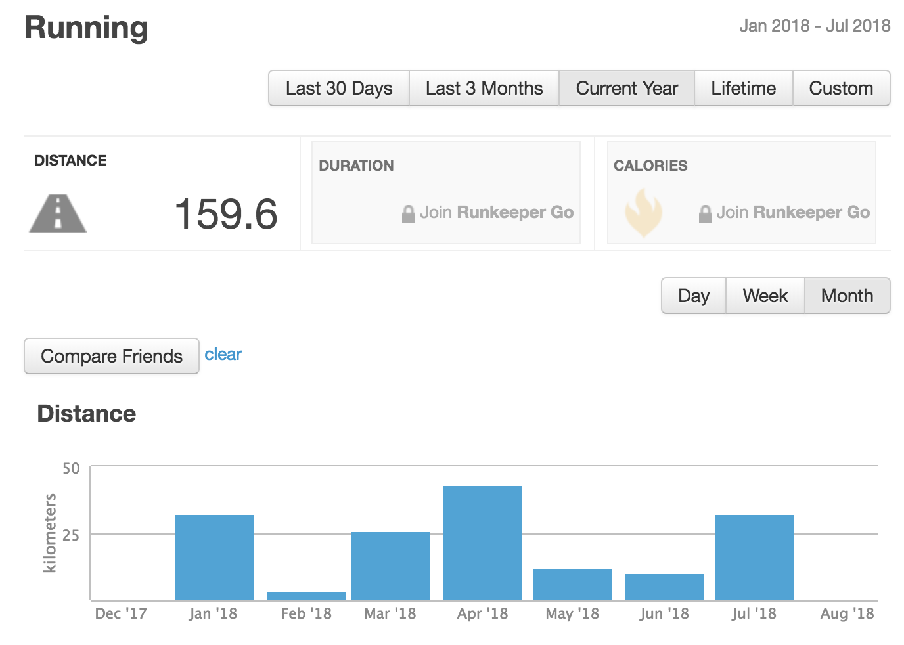
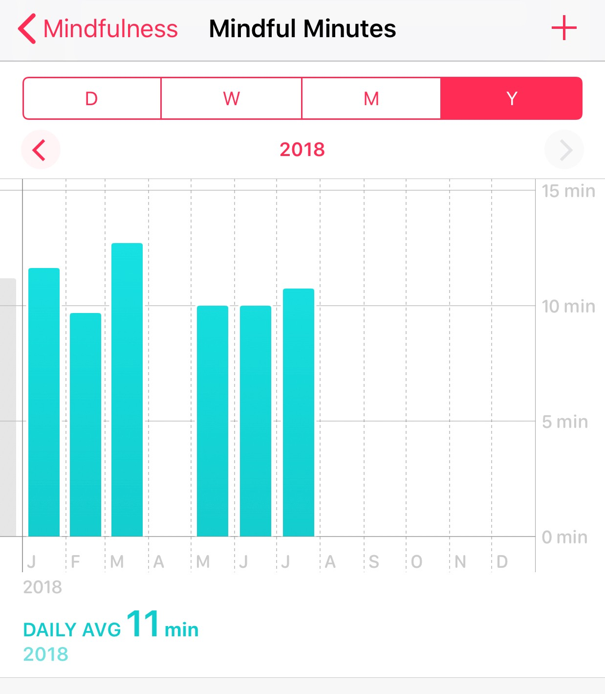
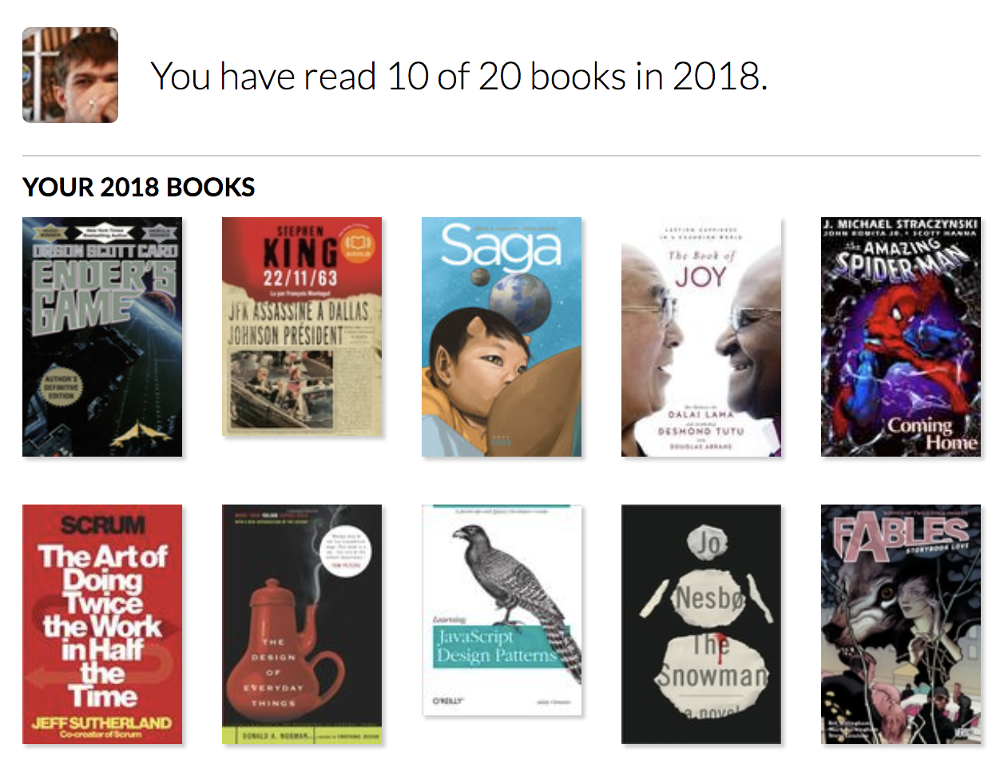

_This post was originally [published on Medium](https://medium.com/@guar47/goals-for-2018-50-d6d4c2627089)._

https://twitter.com/year_progress/status/1013754160456650752

So, halfway there, right? I really didn’t notice how this half-year
passed. Actually, there is more already. I was planning to write it down for too long. At the beginning of the year, I made a statement on Twitter with my goals for 2018 year. Here it is:

https://twitter.com/guar47/status/948059634245488645

I was thinking about posting my half-years review for a month, but then I saw the [post](https://medium.com/@jsjoeio/2018-goals-june-update-69ede0805004) from [Joe Previte](https://twitter.com/jsjoeio) and that inspired me to do it. Let’s see.

---

##

## Get a stable income from a freelance — Success level 80%.

I started working on a Freelance platform [https://upwork.com](https://upwork.com/) in January this year. The main reason for that was the independence from working hours and days. I can work wherever I want and with whom I want.

Surely, it has a lot of cons as well. You have to find clients by
yourself and even with the platform help it still hard to do. Amount of
freelancers is times bigger that amount of customers. First two months
where really hard when you are trying to improve your portfolio and
customer base. Eventually I found a few great customers and work with
them on a long-term basis. These relationships are pretty stable, but
still I can improve a lot.

First of all, I can start by increasing my hourly rate, it’ll give me even more stability. Besides I really want to find a long-term client with React, because I like this lib a lot, so it would be great to work
with it on a daily basis.

In case someone is interested my profile is [here](https://www.upwork.com/freelancers/~01e52252789be044c5).

---

## Go on a long journey around the world (beginning approximately in the fall) — Success level 50%.

This one I am very excited about. This event already has a determined date (3.09.2018). I booked all the flights and accommodations. So it’s just a matter of time now.

My first path will be:
Saint-Petersburg ✈️ Hua-Hin (7d.) ✈️ Bangkok (7d.) ✈️ Chiang Mai (1.5m) ✈️ Kuala Lumpur (3d.) ✈️ Bali (3+m.).

I only booked a few weeks on Bali so I’ll look for a house when I am
on the island. I plan to spend the whole winter there, travel around
Asia and go to Europe for three months when Spring comes.
In addition, I travel this summer. I visited Kaliningrad 🇷🇺/Budapest
🇭🇺/Belgrade 🇷🇸/Novi-Sad 🇷🇸 and I am going to visit Napoli
🇮🇹🍕/Milan 🇮🇹/Budapest 🇭🇺 again (One of the best cities I’ve ever
been)/Debrecen 🇭🇺 in August.

---

## Don’t eat a meat/fish in this year — Success level 99,9%.

This one goes unexpectedly easily and smoothly. Before I decided not
to eat meat I read about it on the Internet and some people said that
you could be experiencing discomfort or you want meat all the time. I
can say it is not true for me.

I just stopped eating meat 1 Jan 2018 and It went so naturally.
Frankly speaking this decision has already made a good effect on my
health. I feel better every day. It’s a bit harder to look for places to eat, especially in countries where vegetarianism is not so popular. But it’s not too hard in general.

So why 99.9%? Some guy from KFC gave me Chicken Twister instead of
Veggie 😆🥦. I don’t blame him, the work at fast food looks really
exhausting, but anyway I was a bit upset 🙃

I’m not gonna eat meat/fish in the future as well.

---

## Improve my English to Upper-Intermediate level — Success 40%

It’s the toughest one. I almost switched all my life (except every
day talking) to English, but it still hard. I have a lot of issues with
the grammar, but I feel some improvements anyway. I hope progress will
be going faster when I am going to live as an expat in non-Russian
speaking countries.

I also have a really great teacher on the English learning platform
who helps me a lot with my issues. I have a weekly meeting with him and
homework.

---

## Finish #100DaysOfCode and coding courses — Success 100%

I finished all courses that I planned at the begging of the year and finished my commitment to #100DaysOfCode.

https://twitter.com/guar47/status/981242389267468289

I still learn a lot though. I start new courses, read programming
books and try to involve myself in the communities which usually really
helpful. I really like two of them — [https://dev.to](https://dev.to/) and [https://forum.freecodecamp.org](https://forum.freecodecamp.org/). And twitter of course.

Btw, dev.to started a really great [mentorship program](https://dev.to/devteam/changelog-mentor-matchmaking-3bl0) a few days ago which I joined as a Frontend mentor and as a Ruby/RoR mentee. Yes, you can be both, cool, right?

Also related to this I wanna force myself to spend a bit more time to be in the community. For me, the best way to learn new things is
talking to people, when you help them and they help you.

In addition, I study in the Online University. Honestly, I already
have a few debts but I continue to learn new interesting stuff. I
discovered [https://www.khanacademy.org/](https://www.khanacademy.org/) which is really helpful for me.

---

## Continue running and start working out in a gym — Success 50%

I really like running. And really don’t like gyms 😔 These feelings lead me to result in this goal.

I went to a gym for a month three days a week and then I stopped. It
takes a lot of time because the gym is too far from my home. But when I
stopped I started running more which is really satisfy me.

Current year stats from Runkeeper:

I’m gonna continue to running and it’ll be great to beat my personal
10km record this summer. I don’t plan to participate in any competition, just with myself.

## Continue meditating on a daily basis — Success 36%

---

I truly like to meditate, but it’s really hard for me to make something a daily habit.

I meditated this year about 72 times (due 201 days) which is approximate ~720 minutes.

Sadly, but in Health you can’t check overall amount of minutes:

I tried several apps for meditation ([Calm](https://www.calm.com/), [Headspace](https://www.headspace.com/), [10% Happier](https://www.10percenthappier.com/)). Eventually, I chose [Insight Timer](https://insighttimer.com/) (thanks Joe for the [suggestion](https://medium.com/@jsjoeio/hi-dmitrii-680891e15a92) and great advices) and it’s pretty great for me. It’s like open source
in Meditation. Other apps more like products by subscription, but this
one has a lot of community content, I love this way more.

Nothing changing here, I’ll trying to make it daily habit.

---

## The additional challenge which I participate in every year is [Goodreads reading challenge](https://www.goodreads.com/challenges/show/7501-2018-reading-challenge) — Success 100%

Here everything goes according to the plan. I read 10/20 books so far and pretty close to finishing another one. My progress on [Goodreads](https://www.goodreads.com/user_challenges/10599444).

PS Saga is amazing by the way

Yeah, I know, the three of them are just comic books, but it counts! 😁 Besides, two of them are pretty big comic books.

---

That’s it for now, I’ll come back at the end of the year to sum up the whole thing and made new goals.

Really appreciate that you’ve read this.
